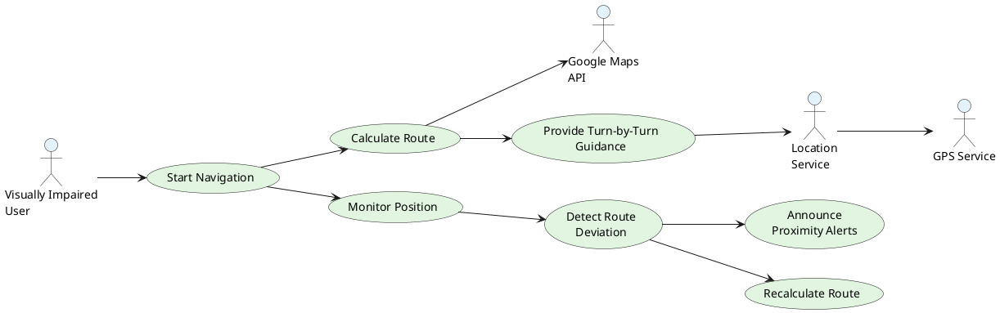
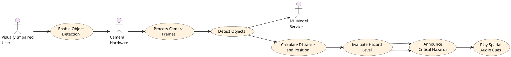
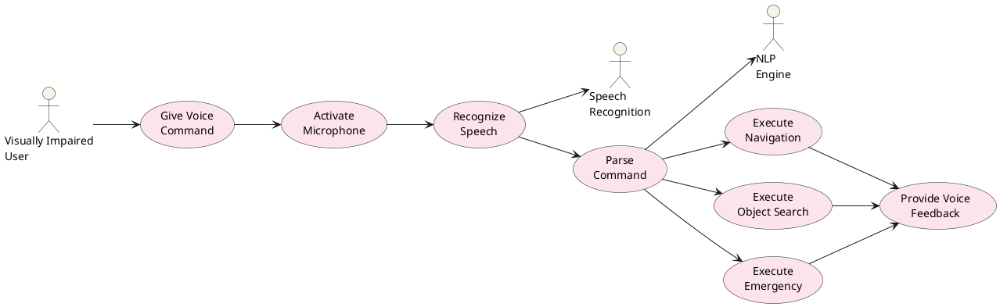
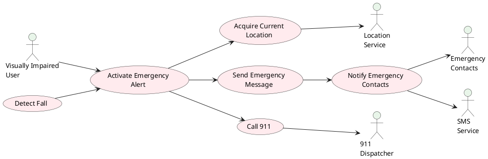
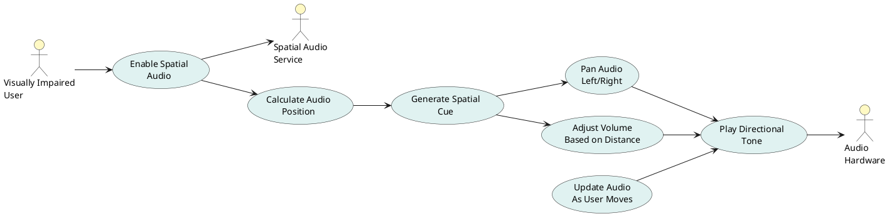
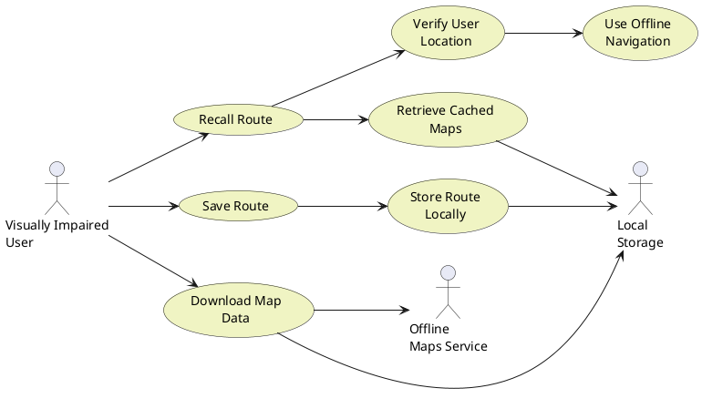
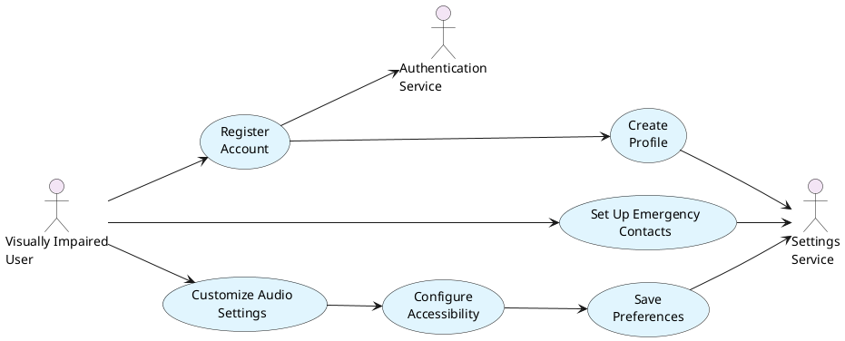
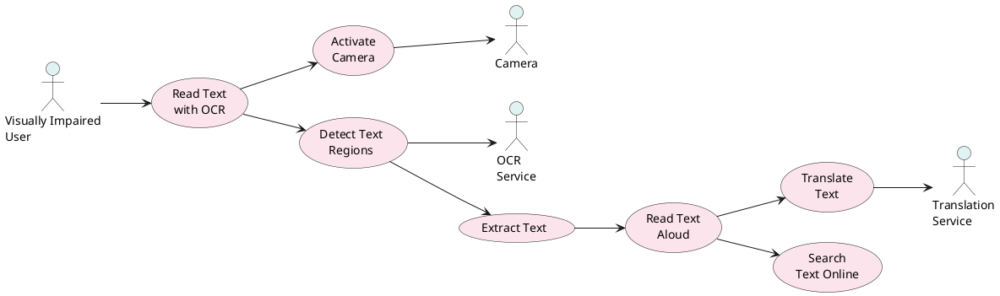
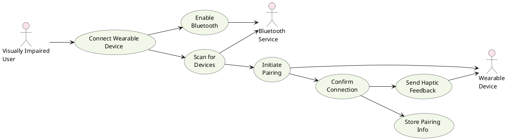
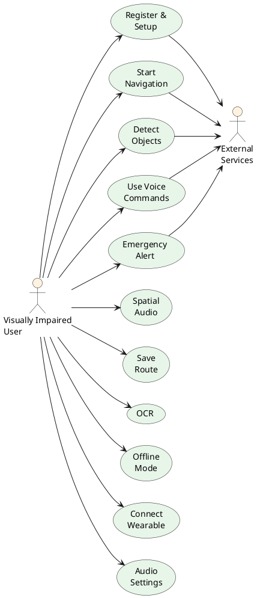

# Use Case Descriptions and Diagrams

## SENSEI - Smart Environmental Navigation System for Enhanced Independence

---

## 1. Overview

This document provides detailed use case descriptions and visual diagrams for all primary interactions within the SENSEI application. Each use case explains how actors (users, system components, external services) interact with the system to achieve specific goals.

---

## 2. Actor Definitions

### Primary Actors

- **Visually Impaired User**: Main user navigating using the app
- **Emergency Contact**: Receives emergency alerts
- **System Administrator**: Manages backend services

### Secondary Actors

- **Google Maps API**: External mapping service
- **Location Service**: GPS provider
- **Camera Hardware**: Device camera for object detection
- **Wearable Device**: Bluetooth-connected accessibility device
- **Emergency Services**: 911 dispatch system

---

## 3. Use Case Descriptions

### UC-01: Register and Create User Account

**Use Case ID**: UC-01  
**Use Case Name**: Register and Create User Account  
**Primary Actor**: Visually Impaired User  
**Secondary Actors**: Authentication Service

**Preconditions**:

- User has installed the SENSEI application
- Device has internet connectivity
- User does not have an existing account

**Main Flow**:

1. User opens the application
2. System displays login screen with registration option
3. User selects "Register" or "Create Account" option
4. System prompts for registration method (email, phone, Google, Apple)
5. User selects preferred authentication method
6. System guides user through voice-based registration process
7. User provides email/phone number
8. System sends verification code
9. User enters verification code
10. User creates password (or uses biometric)
11. System validates password strength
12. User provides accessibility preferences (voice speed, audio volume)
13. System confirms account creation
14. System logs user in and navigates to Home Screen

**Alternate Flow 1 - Social Authentication**:

- At step 4: User selects Google or Apple authentication
- System redirects to OAuth provider
- User completes authentication with provider
- System retrieves user profile and creates account
- Continue from step 12

**Alternate Flow 2 - Biometric Registration**:

- At step 10: User opts for biometric authentication
- System enables Face ID or Touch ID registration
- User completes biometric setup
- Continue from step 11

**Postconditions**:

- User account is created in the system
- User profile includes accessibility preferences
- User is authenticated and logged into the app
- Emergency contacts field is marked for later setup
- User can access Home Screen and other features

**Functional Requirements Satisfied**: FR1.1, FR1.2, FR1.4

---

### UC-02: Set Up Emergency Contacts

**Use Case ID**: UC-02  
**Use Case Name**: Set Up Emergency Contacts  
**Primary Actor**: Visually Impaired User  
**Secondary Actors**: Contacts Service, SMS Service

**Preconditions**:

- User is logged into the application
- User has completed profile setup
- User has access to their phone contacts or can input phone numbers

**Main Flow**:

1. User navigates to Settings Screen
2. User selects "Emergency Contacts" option
3. System presents emergency contact setup screen
4. User selects "Add Emergency Contact" button
5. System offers options: Select from contacts or enter manually
6. User chooses to select from phone contacts
7. System accesses phone contacts list
8. User selects contact(s) using voice commands or touch
9. System reads back selected contact for confirmation
10. User confirms selection
11. System saves emergency contact(s)
12. User can add additional contacts (repeat steps 4-11)
13. User selects "Save" to complete setup
14. System confirms all emergency contacts are saved
15. System stores contacts securely and locally

**Alternate Flow 1 - Manual Contact Entry**:

- At step 6: User chooses to enter contact manually
- System prompts for contact name
- User provides contact name via voice or text input
- System prompts for phone number
- User provides phone number
- System confirms details before saving

**Alternate Flow 2 - Edit Existing Contact**:

- At step 2: User selects "Emergency Contacts"
- System displays list of existing contacts
- User selects contact to edit
- System allows modification of contact details
- User makes changes and confirms
- System updates contact information

**Postconditions**:

- Emergency contacts are stored securely in user profile
- User receives confirmation of saved contacts
- Contacts are available for emergency alerts
- System has voice-read contact list for voice verification

**Functional Requirements Satisfied**: FR1.3, FR7.2, NFR4.4

---

### UC-03: Start Navigation to Destination

**Use Case ID**: UC-03  
**Use Case Name**: Start Navigation to Destination  
**Primary Actor**: Visually Impaired User  
**Secondary Actors**: GPS Service, Google Maps API, Navigation Service

**Preconditions**:

- User is logged in and on Home Screen
- GPS is enabled on device
- Device has internet connectivity (or has cached maps)
- User has already granted location permissions

**Main Flow**:

1. User navigates to Navigation Screen
2. System displays destination input interface
3. User provides destination via voice command: "Navigate to [destination]"
4. System recognizes destination query
5. System sends request to Google Maps API
6. API returns location matches
7. System reads back search results using text-to-speech
8. User selects destination from results using voice: "First result" or "Select [name]"
9. System confirms selection: "Navigating to [destination], [distance] km away"
10. System calculates optimal route
11. System begins GPS tracking
12. System initiates navigation guidance with audio cues
13. System displays real-time navigation on Navigation Screen
14. User receives turn-by-turn instructions via voice and spatial audio
15. System monitors user position relative to route

**Alternate Flow 1 - Search by Address**:

- At step 3: User provides complete address
- System parses address using voice recognition
- Continue from step 5

**Alternate Flow 2 - Select from Recent Routes**:

- At step 2: User asks "Show recent destinations"
- System reads list of previously visited locations
- User selects from list
- Continue from step 9

**Alternate Flow 3 - Offline Navigation**:

- At step 5: Device has no internet connection
- System uses cached offline maps if available
- If cached map exists, continue with navigation
- If not available, system prompts user to download map

**Postconditions**:

- Navigation is actively started
- Real-time turn-by-turn guidance is active
- GPS tracking is running
- Route information is stored in session
- User receives continuous navigation updates

**Functional Requirements Satisfied**: FR2.1, FR2.2, FR6.2, NFR1.2, NFR1.6

---

### UC-04: Detect and Announce Objects

**Use Case ID**: UC-04  
**Use Case Name**: Detect and Announce Objects  
**Primary Actor**: Visually Impaired User  
**Secondary Actors**: Camera, Object Detection Service, Text-to-Speech Service

**Preconditions**:

- User has launched AR Screen or enabled detection mode
- Camera permission is granted
- Device is in motion or user is stationary
- System is initialized and ready for detection

**Main Flow**:

1. User navigates to AR Screen or voice commands "Start detection"
2. System requests permission to access camera
3. User grants camera permission
4. System activates camera feed
5. System begins continuous frame processing
6. For each frame, system runs object detection model
7. System identifies objects with confidence >75%
8. System determines distance to each object
9. System calculates object position (left, center, right)
10. System evaluates hazard level for each object
11. If hazard level is "Critical" (vehicles <5m):
    - System immediately announces: "Vehicle 3 meters ahead on your right"
    - System triggers spatial audio alert
    - System initiates vibration pattern
12. If hazard level is "High" (persons <3m):
    - System announces with medium priority
13. If hazard level is "Medium" or "Low":
    - System periodically announces or provides on-demand information
14. System continuously updates object positions as user moves
15. System removes objects from list when no longer detected or >100m away

**Alternate Flow 1 - Voice-Based Object Query**:

- At step 11: User asks "What do you see?"
- System provides immediate description of current scene
- System announces all detected objects and their locations
- User can request specific object details

**Alternate Flow 2 - Manual Camera Adjustment**:

- During step 5: User rotates device
- System recalibrates detection based on new camera angle
- Object positions update relative to user's new orientation

**Postconditions**:

- User has awareness of surrounding environment
- Critical hazards have been announced
- System maintains continuous detection while enabled
- Object data is logged for learning and safety analysis

**Functional Requirements Satisfied**: FR3.1, FR3.2, FR3.3, FR3.4, FR3.6, FR3.8, FR8.1, FR8.2, FR8.4, NFR1.1

---

### UC-05: Use Voice Commands for System Control

**Use Case ID**: UC-05  
**Use Case Name**: Use Voice Commands for System Control  
**Primary Actor**: Visually Impaired User  
**Secondary Actors**: Voice Recognition Service, System Services

**Preconditions**:

- User has microphone permission granted
- App is active or in foreground
- User has spoken a valid voice command wake word or continuous listening is enabled

**Main Flow**:

1. User initiates voice input by saying "Hey Sensei" or pressing voice button
2. System activates microphone and begins listening
3. System records user speech for 3-5 seconds or until pause detected
4. User speaks command: "Find the coffee shop" or "Navigate to home"
5. System sends audio to speech recognition service
6. System receives text transcription
7. System analyzes command against command patterns
8. System matches command to action type (navigation, detection, info, control, memory, emergency)
9. System extracts parameters from command
10. System executes corresponding action
11. System provides voice feedback: "Navigating to coffee shop"

**Alternate Flow 1 - Complex Multi-Step Command**:

- At step 8: User provides multi-part command: "Find the nearest pharmacy and show me details"
- System breaks down command into sub-tasks
- System executes pharmacy search
- System retrieves pharmacy details (hours, phone, etc.)
- System reads information to user

**Alternate Flow 2 - Unrecognized Command**:

- At step 7: Command doesn't match any pattern
- System responds: "I didn't understand. Please try again or say 'help'"
- System returns to listening mode
- User can repeat or ask for command help

**Alternate Flow 3 - Emergency Command**:

- At step 8: Command contains emergency keywords (help, SOS, emergency)
- System immediately activates emergency protocol
- System bypasses normal processing and triggers UC-11

**Postconditions**:

- Voice command has been processed and executed
- System has provided audio feedback
- Requested action is initiated (navigation, search, control, etc.)
- Command is logged in command history

**Functional Requirements Satisfied**: FR6.1, FR6.2, FR6.3, FR6.4, FR6.6, NFR1.3

---

### UC-06: Enable Spatial Audio Guidance

**Use Case ID**: UC-06  
**Use Case Name**: Enable Spatial Audio Guidance  
**Primary Actor**: Visually Impaired User  
**Secondary Actors**: Spatial Audio Service, Audio Hardware

**Preconditions**:

- User is navigating or in object detection mode
- Audio output permission is granted
- User has connected to audio output (speaker or headphones)
- Spatial audio hardware is supported by device

**Main Flow**:

1. User navigates to Settings or enables spatial audio during navigation
2. System checks device audio capabilities
3. System initializes spatial audio system
4. System configures 3D audio parameters (listener position, orientation)
5. During navigation, system detects upcoming turn
6. System calculates turn direction and distance
7. System creates spatial audio cue at relative position
8. If turn is left: Audio panned to left channel
9. If turn is right: Audio panned to right channel
10. If turn is straight: Audio centered
11. System plays directional tone at calculated volume based on distance
12. System adjusts audio as user moves:
    - Volume decreases as user gets closer to turn point
    - Audio pan angle updates with user's heading
13. When user reaches turn point: System transitions to next instruction
14. System maintains continuous spatial audio feedback throughout navigation

**Alternate Flow 1 - Obstacle Avoidance Audio Cue**:

- During navigation: System detects obstacle via object detection
- System creates spatial audio alert at obstacle location
- Audio position indicates obstacle direction
- User can avoid obstacle based on audio cue position

**Alternate Flow 2 - Custom Sound Profiles**:

- At step 1: User selects audio profile preference
- System loads user's custom sound assignments
- Different object types or commands trigger different audio signatures
- Continue from step 5

**Postconditions**:

- User receives directional audio feedback
- Spatial audio is synchronized with user movement
- User can navigate confidently using audio cues alone
- Audio adjusts dynamically based on context

**Functional Requirements Satisfied**: FR5.1, FR5.2, FR5.3, FR5.4, FR5.5, NFR9.1, NFR9.2, NFR9.3

---

### UC-07: Activate Emergency Alert

**Use Case ID**: UC-07  
**Use Case Name**: Activate Emergency Alert  
**Primary Actor**: Visually Impaired User  
**Secondary Actors**: Emergency Service, SMS Service, Location Service, Emergency Contacts

**Preconditions**:

- User is in emergency situation (fall, lost, threatened)
- Emergency contacts have been set up (UC-02)
- Device has cellular or internet connectivity
- GPS is enabled

**Main Flow**:

1. User detects emergency situation
2. User performs emergency activation:
   - Option A: Press and hold home button for 3 seconds
   - Option B: Say "Emergency" or "SOS"
   - Option C: Voice command "Call 911" or "Emergency Alert"
3. System recognizes emergency trigger
4. System confirms urgency: "Emergency alert activated. Help is on the way."
5. System initiates vibration alert pattern
6. System acquires current GPS location
7. System creates emergency message with timestamp and coordinates
8. System sends emergency alert to all emergency contacts via SMS
9. Message includes: "EMERGENCY: User needs help. Location: [GPS coords]. Time: [timestamp]"
10. System provides user options:
    - "Call 911" - Direct call to emergency services
    - "Share Location" - Send location via messaging
    - "Cancel" - Deactivate alert if false alarm
11. If user selects "Call 911":
    - System initiates phone call to 911
    - System displays caller info to dispatcher if available
12. System continues location tracking while emergency is active
13. Emergency contacts receive SMS and location link
14. User receives confirmation: "Emergency services notified"

**Alternate Flow 1 - Fall Detection Triggers Emergency**:

- At step 1: System detects fall via accelerometer (falls detection algorithm)
- System immediately triggers emergency protocol
- System announces: "Fall detected. Sending emergency alert in 10 seconds"
- User has 10 seconds to cancel if false alarm
- If not canceled, continue from step 3

**Alternate Flow 2 - No Cellular Connection**:

- At step 8: Device has no cellular connection
- System attempts to send via internet (SMS over IP)
- If internet available, send to contacts via email/app notification
- Continue with other steps

**Alternate Flow 3 - Cancel False Emergency**:

- At step 10: User selects "Cancel"
- System cancels emergency alert before sending
- System displays: "Emergency alert canceled"
- System logs incident for safety analysis

**Postconditions**:

- Emergency contacts have been notified
- Emergency services (911) may be involved
- User location is being actively tracked
- Emergency mode remains active until user or emergency services confirm resolution
- Incident is logged with timestamp and location for record-keeping

**Functional Requirements Satisfied**: FR7.1, FR7.2, FR7.3, FR7.4, FR7.5, FR7.6, NFR4.3, NFR4.4

---

### UC-08: Save and Recall Route

**Use Case ID**: UC-08  
**Use Case Name**: Save and Recall Route  
**Primary Actor**: Visually Impaired User  
**Secondary Actors**: Route Memory Service, Local Storage

**Preconditions**:

- User has completed a navigation session (reached destination or stopped navigation)
- User has traveled significant distance (>100 meters)
- System has route data stored in memory

**Main Flow**:

1. User completes navigation to destination
2. System announces: "You've arrived at your destination"
3. System displays route summary (distance, time, turns)
4. User requests to save route: "Save this route" or voice command "Remember this path"
5. System prompts for route name: "What would you like to call this route?"
6. User provides route name: "Route to Coffee Shop" or "Home to Office"
7. System confirms: "Saving route as '[name]'"
8. System stores route data locally:
   - Start point, end point
   - All waypoints and turns
   - Detected hazards along route
   - Time of day recorded
9. System provides confirmation: "Route saved successfully"
10. Later, user requests recall: "Navigate to saved route 'Coffee Shop'"
11. System retrieves stored route
12. System verifies current location is near route start point
13. System begins guided navigation using saved route
14. System provides familiar guidance based on route history

**Alternate Flow 1 - Edit Saved Route**:

- At step 10: User selects "Manage Routes"
- System displays list of saved routes
- User selects route to edit
- System allows modification of route name, start/end points
- User confirms changes
- System updates route

**Alternate Flow 2 - Delete Route**:

- At step 10: User selects "Manage Routes"
- System displays list of saved routes
- User selects "Delete route"
- System confirms deletion
- User confirms
- Route is removed from local storage

**Alternate Flow 3 - Route Not Available (Offline)**:

- At step 11: Device has no internet connection
- System uses locally cached route data
- If route exists locally, navigation proceeds
- If not cached, system prompts user to download

**Postconditions**:

- Route is saved locally for future use
- Route can be quickly recalled without re-searching
- User has faster navigation for frequently traveled paths
- System has learned common user routes for smart suggestions

**Functional Requirements Satisfied**: FR12.1, FR12.2, FR12.3, FR9.1, FR9.2

---

### UC-09: Read Text with OCR

**Use Case ID**: UC-09  
**Use Case Name**: Read Text with OCR  
**Primary Actor**: Visually Impaired User  
**Secondary Actors**: Camera, OCR Service, Text-to-Speech Service

**Preconditions**:

- User has granted camera permission
- User is at location with visible text (sign, document, label)
- Device has camera access
- OCR model is loaded (downloaded or cached)

**Main Flow**:

1. User navigates to AR Screen or says "Read text" or "Scan"
2. System activates camera
3. System displays live camera feed
4. User positions device toward text
5. System continuously processes video frames
6. System applies OCR model to detect text regions
7. When text is detected and confidence >80%:
   - System highlights detected text in AR view
   - System reads detected text using text-to-speech
8. System provides text options:
   - "Translate" - Translate to other language
   - "Copy" - Copy text to clipboard
   - "Search" - Search for text online
   - "More" - Additional options
9. User selects option via voice command
10. If "Translate": System translates text and reads aloud
11. If "Search": System searches detected text and reads results
12. User can reposition for different text on same screen

**Alternate Flow 1 - Document Scanning**:

- At step 2: User selects "Scan Document"
- System activates camera in document mode
- System automatically detects document boundaries
- User can press to capture page
- System performs OCR on full page
- System reads entire page content

**Alternate Flow 2 - Continuous OCR Mode**:

- At step 1: User enables "Continuous Reading"
- System reads all text it encounters
- User can move camera to different areas
- System provides real-time text feedback

**Postconditions**:

- Text has been read to user
- User has access to translation or additional information
- Text data can be stored for future reference
- User gained independence to read signs, menus, labels, documents

**Functional Requirements Satisfied**: FR11.1, FR11.2, FR11.3, FR11.4

---

### UC-10: Connect Wearable Device

**Use Case ID**: UC-10  
**Use Case Name**: Connect Wearable Device  
**Primary Actor**: Visually Impaired User  
**Secondary Actors**: Bluetooth Service, Wearable Device

**Preconditions**:

- Wearable device is powered on and in pairing mode
- Bluetooth is enabled on smartphone
- Wearable device is within Bluetooth range (~10 meters)
- User has Bluetooth permissions granted

**Main Flow**:

1. User navigates to Settings Screen
2. User selects "Bluetooth" or "Connected Devices"
3. System displays list of available Bluetooth devices
4. System starts Bluetooth scan
5. System discovers wearable device (e.g., "SENSEI Haptic Band")
6. System reads available devices to user
7. User voice-selects device: "Connect to Haptic Band" or "First device"
8. System initiates pairing request to wearable
9. Wearable device prompts user to confirm pairing (may require button press)
10. User confirms on wearable device
11. System establishes secure Bluetooth connection
12. System exchanges pairing credentials
13. System reads back: "Successfully connected to [device name]"
14. System tests connection with haptic feedback test pattern
15. User feels haptic pulse confirming connection
16. System stores device pairing for auto-connect in future

**Alternate Flow 1 - Manual Device Entry**:

- At step 3: User chooses "Pair New Device"
- System enters manual pairing mode
- User provides device address or name manually
- System attempts connection to specified device

**Alternate Flow 2 - Connection Failure**:

- At step 11: Connection fails
- System announces: "Connection failed. Please ensure device is on and nearby"
- System provides troubleshooting steps
- User can retry or select different device

**Postconditions**:

- Wearable device is paired and connected
- System can send haptic feedback to wearable
- Connection persists for future app sessions
- Wearable can enhance navigation with haptic cues

**Functional Requirements Satisfied**: FR10.1, FR10.2, FR10.3, FR10.4

---

### UC-11: Use Offline Navigation Mode

**Use Case ID**: UC-11  
**Use Case Name**: Use Offline Navigation Mode  
**Primary Actor**: Visually Impaired User  
**Secondary Actors**: Offline Storage, Location Service, Local Navigation Engine

**Preconditions**:

- User has previously downloaded map data for desired area
- GPS is enabled (works offline)
- App is installed with offline capabilities
- Navigation route is saved locally or available offline

**Main Flow**:

1. User opens app (device may be in airplane mode or no cell service)
2. System detects no internet connectivity
3. System checks for locally cached map data
4. If cached data exists:
   - System displays "Offline Mode" indicator
   - System allows navigation within cached area
5. User navigates to Navigation Screen
6. User requests navigation to destination: "Navigate to [location]"
7. System checks if destination is within offline map area
8. If yes:
   - System calculates route using local map data
   - System initiates offline navigation
9. System provides turn-by-turn guidance using cached data
10. GPS provides real-time location (works offline)
11. System plays offline audio guidance (pre-recorded or synthesized)
12. System continues navigation as long as user stays in cached map area
13. If user navigates outside cached area:
    - System alerts: "Moving outside offline map area"
    - System prompts to download more maps or use saved routes
14. When internet is restored, system syncs any recorded data

**Alternate Flow 1 - Download Map for Offline Use**:

- At step 3: No cached maps available for current area
- User selects "Download Map for Offline"
- System displays available map areas
- User selects area to download
- System downloads map data (~50MB per area)
- Download progress shown via voice updates
- Upon completion, offline mode becomes available

**Alternate Flow 2 - Saved Route in Offline Mode**:

- At step 6: User recalls saved route
- System uses local route data (no internet needed)
- Full navigation proceeds offline
- No map tiles needed if route was previously cached

**Postconditions**:

- User can navigate even without cellular/WiFi connection
- Navigation reliability is maintained
- System logs offline navigation session
- User gains independence in areas with poor connectivity

**Functional Requirements Satisfied**: FR9.1, FR9.2, FR9.3, FR9.4, NFR3.2, NFR3.4

---

### UC-12: Customize Audio and Accessibility Settings

**Use Case ID**: UC-12  
**Use Case Name**: Customize Audio and Accessibility Settings  
**Primary Actor**: Visually Impaired User  
**Secondary Actors**: Settings Service, Audio System

**Preconditions**:

- User is logged in and on Settings Screen
- User has navigated to Accessibility or Audio settings

**Main Flow**:

1. User opens Settings Screen
2. System displays settings categories using voice menu
3. User selects "Audio Settings" or "Accessibility"
4. System displays available audio settings:
   - Speech speed (0.5x to 2.0x)
   - Speech pitch (adjustable)
   - Audio volume (0-100%)
   - Audio output method (speaker, headphones, wearable)
5. User adjusts speech speed: "Set speech speed to 1.5x"
6. System confirms: "Speech speed set to 1.5x"
7. System applies setting immediately for preview
8. User tests setting: "Read test message"
9. System plays test message with new settings
10. User confirms or adjusts further
11. User adjusts volume: "Set volume to 80%"
12. System confirms and applies
13. User navigates to additional settings:
    - Haptic feedback enable/disable
    - Audio cues style
    - Emergency alert volume
    - Screen reader verbosity level
14. User saves all settings
15. System confirms: "Settings saved successfully"
16. Settings are persistent for future sessions

**Alternate Flow 1 - Reset to Default**:

- At step 14: User requests "Reset to defaults"
- System confirms action
- All settings revert to default values
- User can confirm reset or cancel

**Alternate Flow 2 - Import Settings Profile**:

- At step 1: User selects "Import Settings"
- System displays available preset profiles
- User selects profile (e.g., "Quiet Environment", "Noisy Commute")
- System imports and applies all settings from profile
- User can still customize further

**Postconditions**:

- User's audio preferences are saved
- All app audio uses customized settings
- User has optimal accessibility configuration
- Settings persist across app sessions and device reboots

**Functional Requirements Satisfied**: FR1.4, FR2.1, FR5.1, FR6.6, NFR2.3, NFR2.4, NFR9.1

---

## 4. Use Case Diagrams (PlantUML Code)

### UC Diagram 1: Core Navigation and Guidance System



**Diagram Description**: This diagram shows the core navigation workflow. The user initiates navigation, which triggers route calculation with Google Maps API. The system then begins providing turn-by-turn guidance while continuously monitoring the user's position. If the user deviates from the route, the system detects this and either announces proximity alerts or recalculates the route automatically.

---

### UC Diagram 2: Object Detection and Hazard Management



**Diagram Description**: This diagram illustrates the object detection pipeline. When the user enables object detection, the system captures frames from the camera, processes them with a machine learning model to identify objects, calculates their distance and position, evaluates hazard levels, and announces critical hazards with spatial audio cues.

---

### UC Diagram 3: Voice Command System



**Diagram Description**: This diagram shows the voice command processing flow. The user initiates a voice command, the microphone is activated, speech is recognized and converted to text, the NLP engine parses the command to determine the action type, and the appropriate action (navigation, search, emergency) is executed. The system then provides voice feedback confirming the action.

---

### UC Diagram 4: Emergency and Safety Services



**Diagram Description**: This diagram shows emergency alert workflows. The user can manually activate an emergency alert or the system can automatically detect a fall. When triggered, the system acquires the user's location, sends emergency messages to contacts, and can initiate a 911 call. All emergency contacts are notified via SMS.

---

### UC Diagram 5: Spatial Audio and Navigation Guidance



**Diagram Description**: This diagram depicts the spatial audio system. When enabled, the system calculates where audio should come from (left, right, center, front, back), generates appropriate spatial cues, pans audio to the correct channel, and adjusts volume based on distance to the target. The audio updates continuously as the user moves.

---

### UC Diagram 6: Route Memory and Offline Navigation



**Diagram Description**: This diagram shows route memory and offline navigation. Users can save routes locally, which are stored in device storage. Later, routes can be recalled and verified. The system also supports downloading map data for offline use, enabling navigation without internet connectivity.

---

### UC Diagram 7: Account Management and Accessibility Setup



**Diagram Description**: This diagram shows the account management and setup workflow. Upon registration, a user account is created and an authentication service is involved. Users can then set up emergency contacts and customize accessibility settings including audio preferences, which are all saved to the settings service.

---

### UC Diagram 8: OCR and Text Reading



**Diagram Description**: This diagram illustrates the OCR workflow. When the user requests to read text, the camera is activated, text regions are detected, text is extracted using OCR service, and the text is read aloud. Users can also request translation or online search of detected text.

---

### UC Diagram 9: Wearable Device Integration



**Diagram Description**: This diagram shows the wearable device connection process. The user enables Bluetooth, the system scans for and discovers wearable devices, initiates pairing, confirms the connection, and stores pairing information for future use. Once connected, the system can send haptic feedback to the wearable device.

---

### UC Diagram 10: Complete System Interaction



**Diagram Description**: This comprehensive diagram shows all major use cases and how the user interacts with different system components. It demonstrates the breadth of functionality available to the user while indicating which use cases interact with external services.

---

## 5. Use Case Relationships and Dependencies

### Primary Use Case Dependencies

| Use Case          | Depends On                              | Reason                                                  |
| ----------------- | --------------------------------------- | ------------------------------------------------------- |
| UC-3 (Navigation) | UC-1 (Register), UC-2 (Emergency Setup) | Must be logged in; emergency contacts needed for safety |
| UC-4 (Detection)  | UC-1 (Register)                         | Requires authentication                                 |
| UC-5 (Voice)      | UC-1 (Register), UC-12 (Settings)       | Needs user profile and audio settings                   |
| UC-7 (Emergency)  | UC-2 (Emergency Contacts)               | Must have contacts set up first                         |
| UC-8 (Save Route) | UC-3 (Navigation)                       | Can only save after completing navigation               |
| UC-9 (OCR)        | UC-1 (Register)                         | Requires authenticated user                             |
| UC-11 (Offline)   | Downloaded maps or saved routes         | Requires pre-downloaded/cached data                     |
| UC-12 (Settings)  | UC-1 (Register)                         | User profile must exist                                 |

### Sequential User Journey

```
UC-1: Register Account
  └─> UC-2: Set Up Emergency Contacts
        └─> UC-12: Customize Settings
              └─> UC-3: Start Navigation
                    ├─> UC-4: Detect Objects (parallel)
                    ├─> UC-5: Voice Commands (parallel)
                    ├─> UC-6: Spatial Audio (parallel)
                    └─> UC-8: Save Route (after completion)

  └─> UC-9: Read Text (independent)
  └─> UC-10: Connect Wearable (optional)
  └─> UC-11: Use Offline Mode (when offline)
  └─> UC-7: Emergency Alert (when needed)
```

---

## 6. Use Case Scenarios

### Scenario 1: Daily Commute Navigation

**Actor**: Visually Impaired User (John)  
**Goal**: Safely navigate from home to office using familiar route

**Steps**:

1. John opens SENSEI app (already registered, UC-1 complete)
2. John says "Navigate to office"
3. System recognizes office as saved location (UC-8 previous save)
4. System immediately begins navigation with familiar route
5. Spatial audio provides turn-by-turn guidance (UC-6)
6. John says "What's nearby?" - system uses voice commands to detect surroundings (UC-5)
7. System detects vehicles 8 meters away - announces via spatial audio (UC-4)
8. John continues navigating, system provides proximity alerts as he approaches turns
9. John says "Did I take the right turn?" - system confirms via voice
10. John arrives at office - system announces arrival
11. John says "Save this route" - system saves for future use (UC-8)

**Outcome**: Safe navigation completed with familiar assistive technology

---

### Scenario 2: Emergency Situation

**Actor**: Visually Impaired User (Maria)  
**Goal**: Get help when experiencing a fall or emergency

**Steps**:

1. Maria is navigating outdoors (active navigation session)
2. Maria trips and falls (detected by accelerometer, UC-7 alternate flow)
3. System announces: "Fall detected. Emergency alert in 10 seconds"
4. If Maria is conscious and able, she can cancel (false alarm prevention)
5. If not canceled, system triggers emergency protocol (UC-7)
6. System acquires GPS location
7. Emergency SMS sent to all emergency contacts with location link
8. System offers "Call 911" option
9. Maria confirms, system dials 911
10. Emergency services receive call and location information
11. Maria's caregivers receive SMS and can monitor via location link
12. Once help arrives, emergency mode can be deactivated

**Outcome**: Emergency services dispatched, family notified, user assisted

---

### Scenario 3: Exploring New Environment with OCR

**Actor**: Visually Impaired User (David)  
**Goal**: Read signs and text in a new location (shopping mall)

**Steps**:

1. David enters shopping mall (low internet reliability)
2. David says "Read signs" - activates OCR mode (UC-9)
3. David points camera at store sign
4. System detects text: "Coffee Shop - 2nd Floor"
5. System reads text aloud: "Coffee Shop, second floor"
6. David says "Show more options" - system lists nearby readable signs
7. David asks for translation: "Translate to Spanish"
8. System translates and reads Spanish version
9. David can search detected text online if desired
10. David navigates through mall using object detection (UC-4) to avoid obstacles

**Outcome**: Independent exploration of unfamiliar environment

---

## 7. Use Case Metrics and Priorities

### Priority Matrix

| Use Case                  | Priority | Frequency          | Complexity | Impact   |
| ------------------------- | -------- | ------------------ | ---------- | -------- |
| UC-1 (Register)           | Critical | Once per user      | Low        | High     |
| UC-2 (Emergency Contacts) | Critical | Setup only         | Low        | Critical |
| UC-3 (Navigation)         | Critical | Daily              | High       | Critical |
| UC-4 (Detection)          | Critical | Frequent           | High       | Critical |
| UC-5 (Voice Commands)     | High     | Frequent           | High       | High     |
| UC-6 (Spatial Audio)      | High     | During navigation  | Medium     | High     |
| UC-7 (Emergency)          | Critical | Rare but critical  | Medium     | Critical |
| UC-8 (Save Route)         | Medium   | Frequent           | Low        | Medium   |
| UC-9 (OCR)                | Medium   | Occasional         | Medium     | Medium   |
| UC-10 (Wearable)          | Low      | Setup only         | Medium     | Low      |
| UC-11 (Offline)           | Medium   | Occasional         | Medium     | Medium   |
| UC-12 (Settings)          | Medium   | Setup + occasional | Low        | Medium   |

---

## 8. Conclusion

These 12 use cases represent the complete user interaction patterns for the SENSEI application. Each use case includes:

- **Clear actor definitions** - Who is involved
- **Preconditions** - What must be true before starting
- **Main flow** - The happy path
- **Alternate flows** - What happens when things vary
- **Postconditions** - The outcome and state after completion
- **Related functional requirements** - Which FR/NFR are satisfied

The accompanying PlantUML diagrams provide visual representations of how these use cases interact with various system components and external services.

---

_This use case documentation provides a foundation for development, testing, and validation of the SENSEI system._
